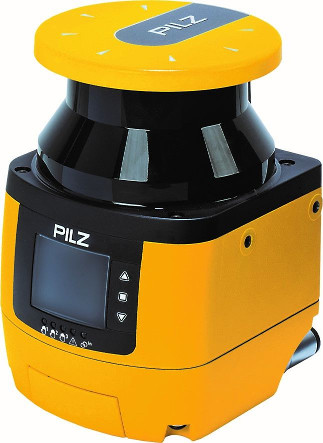

# PILZ Safety Laserscanner PSENscan

## Package: psen_scan

The **psen_scan** package is a ROS integration of the PSENscan Safety laser scanner product. It allows for an easy integration of the Laserscanner-data into your ROS-Environment. Using the standard [sensor_msgs/LaserScan][] message format ensures compatibility with other laserscan-post-processing nodes such as [gmapping][].

<p align="center">

</p>

| Type | Features | Order number |
|------|----------|--------------|
| |	Common features:<ul><li>compliant and approved in accordance with: EN/IEC 61496-1: Type 3, EN ISO 13849-1: PL d, IEC 61508: SIL 2</li><li>opening angle: 275°</li><li>operating range: 3.0 or 5.5 m safety zone, 40 m warning zone</li><li>reaction time: 62 ms</li><li>Protection type: IP65</li><li>Dimensions (H x W x D) in mm: 152 x 102 x 112.5</li></ul> | |
| |Light versions	Additional features: Muting, EDM, Override | |
| PSEN sc L 3.0 08-12	3.0 m | safety zone, 8 or 12-pin exchangeable memory module |	6D000012 |
| PSEN sc L 5.5 08-12	5.5 m | safety zone, 8 or 12-pin exchangeable memory module	| 6D000013 |
| | Master versions	Additional features: Muting, EDM, Override, restart in accordance with EN ISO 61496-3, vertical applications| |
| PSEN sc M 3.0 08-12	3.0 m | safety zone, 8 or 12-pin exchangeable memory module	| 6D000016 |
| PSEN sc M 5.5 08-12	5.5 m | safety zone, 8 or 12-pin exchangeable memory module	| 6D000017 |

## Table of Contents

1. [Setup](#setup)
2. [ROS API](#ros_api)
3. [Usage](#usage)

## Setup

Needed Equipment:
- PSENscan Safety laser scanner
- ROS Machine

## ROS API

### Published Topics
/laser_scanner/scan ([sensor_msgs/LaserScan][])<br/>
Publishes a complete scan from the PSENscan Safety laser scanner.

### Parameters
_password_ (_string_, default: "ac0d68d033")<br/>
Password for Safety laser scanner.

_host_ip_ (_string_, default: "192.168.0.50")<br/>
IP-Address of host machine.

_host_udp_port_ (_int_, default: 55115)<br/>
UDP Port on which packets from Safety laser scanner should be received.

_sensor_ip_ (_string_, default: "192.168.0.10")<br/>
IP-Address of Safety laser scanner.

_frame_id_ (_string_, default: "scanner")<br/>
Identifier used for transformations within ROS environment.

_skip_ (_int_, default: 0)<br/>
How many incoming frames should be skipped (reduces publish rate).

_angle_start_ (_float_, default: 0)<br/>
Start angle of measurement.

_angle_end_ (_float_, default: 275)<br/>
End angle of measurement.

_publish_topic_ (_string_, default: "scan")<br/>
Topic to publish LaserScan data on.

_node_name_ (_string_, default: "laser_scanner")<br/>
Name of Node in ROS Environment. Useful when using multiple Scanners.

## Usage
To start reading from the Safety laser scanner and publishing complete scans execute `roslaunch psen_scan psen_scan.launch` in a command line. This will launch the ROS Node with the default configuration.

If you wish to set parameters from the command line, add them to the end of the command as follows: `parameter:=value`, separated by spaces.

```bash
roslaunch psen_scan psen_scan.launch host_ip:=192.168.0.20 host_udp_port:=3050
```
This example configures the Safety laser scanner to send it´s frames to 192.168.0.20:3050.

## You need further information?
Our international hotline staff will support you individually about our ROS packages at
ros@pilz.de

Find more information about the Pilz manipulator module on the [product website](https://www.pilz.com/en-INT/eshop/00106002197131/PSENscan-Safety-Laser-Scanner).

## Visit us at [pilz.com](https://www.pilz.com)
Pilz is an international-scale, innovative automation technology company.
Pilz uses its solutions to create safety for man, machine and the environment.
In addition to head office in Ostfildern near Stuttgart,
the family business is represented over 2,400
employees at 42 subsidiaries and branches on all
continents.

The company’s products include sensor technology, electronic monitoring relays, safety
relays, configurable and programmable control systems, automation solutions with motion
control, systems for industrial communication as well as visualization solutions and
operator terminals.

Pilz solutions can be used in all areas of mechanical engineering, including the packaging
and automotive sector, plus the railway technology, press and wind energy sectors.
These solutions ensure that baggage handling systems run safely at airports and
funiculars or roller coasters travel safely; they also guarantee fire protection and energy
supply in buildings.


[sensor_msgs/LaserScan]: http://docs.ros.org/melodic/api/sensor_msgs/html/msg/LaserScan.html
[gmapping]: http://wiki.ros.org/gmapping